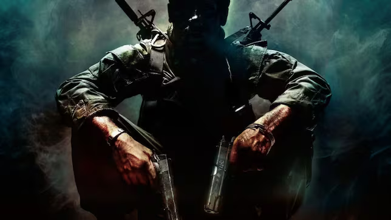

# Call Of Duty
## Rubén Abreu González



Este es el proyecto final de programación del curso 1ºDAM del IES Telesforo Bravo 2023/2024.

Dicho proyecto consiste en la creación de una API rest securizada acerca de la famosa franquicia Call of Duty de Activision.

## Índice
- [Tecnologías a utilizar](#tecnologías-a-utilizar)
- [Enlace de conexión a Swagger](#enlace-de-conexión-a-swagger)

### Tecnologías a utilizar
- Spring Data
- Swagger
- Mockito
- Mapstruct
- Hibernate/JPA

### Enlace de conexión a Swagger
```code
http://localhost:8080/swagger-ui/index.html
```
