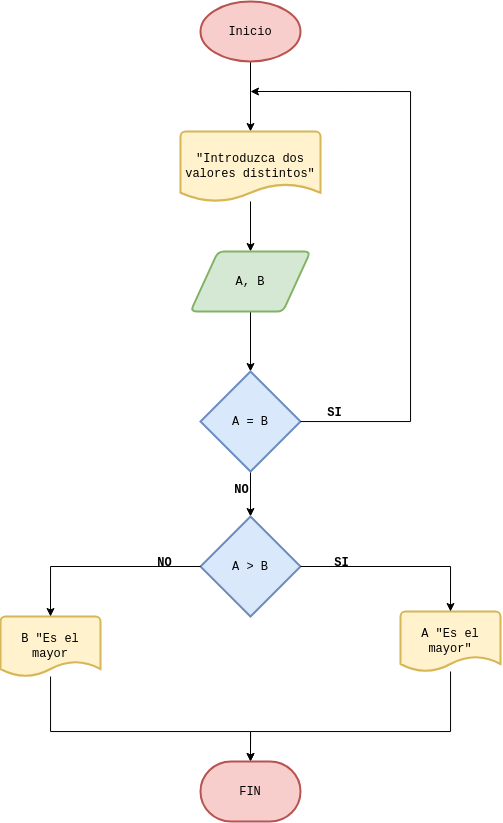

# Ejercicios
- [Ejercicio 1](#ejercicio-1)

## Ejercicio 1 
Desarrolle un algoritmo que permita leer dos valores distintos, determinar cual de los dos valores es el
mayor y escribirlo.

### Diagrama de Flujo

git