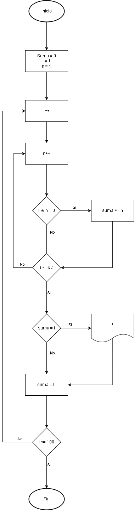

## Ejercicio 2
## Descripción del ejercicio
Un número perfecto es aquel que es igual a la suma de sus divisores propios (excluyendo él mismo). Por ejemplo, 6 es un número perfecto porque sus divisores propios son 1, 2 y 3, y 1 + 2 + 3 = 6. El ejercicio consiste en escribir un programa que encuentre e imprima todos los números perfectos en un rango dado (por ejemplo, entre 1 y 1000).

## Diagrama de flujos

## Pseudocódigo
Pasos=
- Inicio
- Declarar variables: __suma = 0, i = 1, n = 1__
- Creamos un incremento __i++__
- Creamos un incremento __n++__
- Si __i % n = 0__ Sumar valor __suma__ a __n__
- Fin_Si
- Si __n <= i/2__ volver a paso 4
- Fin_Si
- Si __suma = i__ Escribir ___i___
- Fin_Si
- Reiniciar suma, __suma = 0__
- Si __i <= 1000__ volver al paso 3
- Fin_Si
- Fin

## Referencias
- [Ejercicio 2](src/main/java/eercicio2.java)

## Ejercicio 8
## Descripción del ejercicio
Desarrolle un algoritmo que permita calcular Promedio de Notas; finaliza cuando N = 0.

## Diagrama de flujos

## Pseudocódigo
Pasos=
- Inicio
- Declarar variables: __numero, sumatorio = 0__
- Preguntar valor __numero__
- Leer el valor __numero__
- Creamos la varibale __N = numero-1__ y Añadimos un incremento negativo __N--__
- Preguntar valores
- Mientras __N >= 0__ Sumar valor al valor anterior
- Cuando __N < 0__ Escribir __sumatorio / numero__
- Fin

## Referencias
- [Ejercicio 8](src/main/java/ejercicio8.java)

