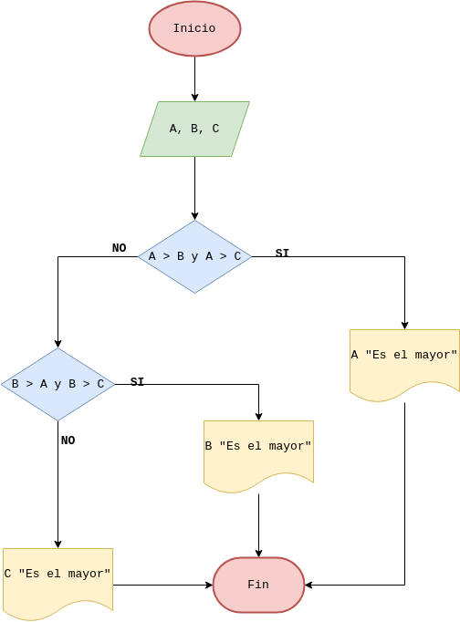

# Ejercicios
- [Ejercicio 2](#ejercicio2)
- [Ejercicio 3](#ejercicio3)
- [Ejercicio 4](#ejercicio4)
- [Ejercicio 5](#ejercicio5)
- [Ejercicio 6](#ejercicio6)
- [Ejercicio 7](#ejercicio7)
- [Ejercicio 8](#ejercicio8)
- [Ejercicio 9](#ejercicio9)

<!-- Ejercicio 2 -->
## Ejercicio 2 
## Descripción del ejercicio

## Diagrama de flujos

## Pseudocódigo
Pasos=
- Inicio
- Inicializar variables: __A = 0 , B = 0__
- Solicitar la introducción de dos valores distintos
- Leer los dos valores
- Asignarlos a las variables __A y B__
- Si __A = B__ Entonces vuelve a 3 porque los valores deben ser distintos
- Si __A > B__ Entonces Escribir ___A, “Es el mayor”___
- De lo contrario: Escribir ___B, “Es el mayor”___
- Fin_Si
- Fin

## Referencias
- [Ejercicio 2](src/main/java/Ejercicio2.java)

<!-- Ejercicio 3 -->
## Ejercicio 3 
## Descripción del ejercicio

## Diagrama de flujos

## Pseudocódigo

## Referencias
- [Ejercicio 3](src/main/java/Ejercicio3.java)

<!-- Ejercicio 4 -->
## Ejercicio 4 
## Descripción del ejercicio

## Diagrama de flujos

## Pseudocódigo

## Referencias
- [Ejercicio 4](src/main/java/Ejercicio4.java)

<!-- Ejercicio 5 -->
## Ejercicio 5 
## Descripción del ejercicio

## Diagrama de flujos

## Pseudocódigo

## Referencias
- [Ejercicio 5](src/main/java/Ejercicio5.java)

<!-- Ejercicio 6 -->
## Ejercicio 6 
## Descripción del ejercicio

## Diagrama de flujos

## Pseudocódigo

## Referencias
- [Ejercicio 6](src/main/java/Ejercicio6.java)

<!-- Ejercicio 7 -->
## Ejercicio 7 
## Descripción del ejercicio

## Diagrama de flujos

## Pseudocódigo

## Referencias
- [Ejercicio 7](src/main/java/Ejercicio7.java)

<!-- Ejercicio 8 -->
## Ejercicio 8 
## Descripción del ejercicio

## Diagrama de flujos

## Pseudocódigo

## Referencias
- [Ejercicio 8](src/main/java/Ejercicio8.java)

<!-- Ejercicio 9 -->
## Ejercicio 9 
## Descripción del ejercicio

## Diagrama de flujos

## Pseudocódigo

## Referencias
- [Ejercicio 9](src/main/java/Ejercicio9.java)

