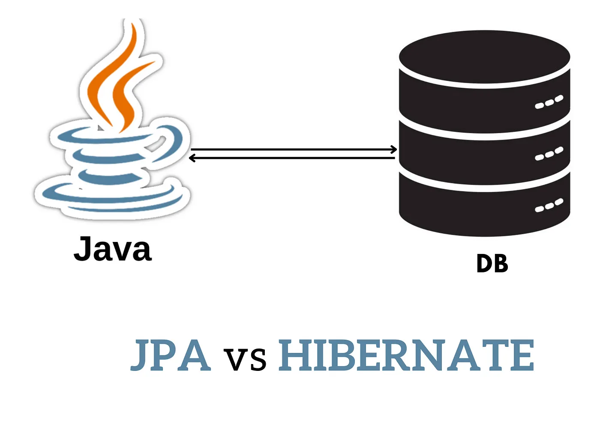

# Sqlite-Jpa

    

## Descripción

Proyecto diseñado para brindar integración JPA con base de datos relacional SQLite.
Este ejemplo utiliza:
- JPA.
- Hibernate 5.
- JUnit 5

## Referencias

Este proyecto es una clonación y refactorización del proyecto [josueribeiro- sqlite-jpa](https://github.com/josueribeiro/sqlite-jpa/tree/master),